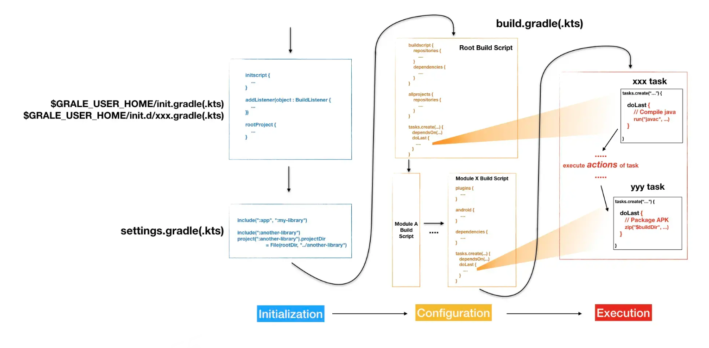
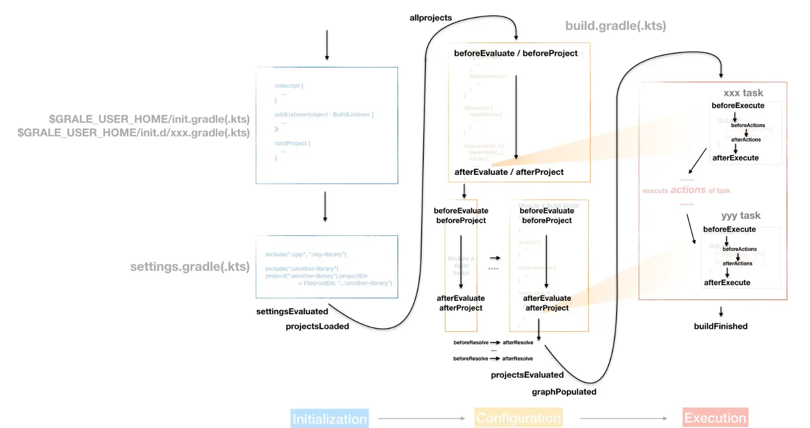

# Gradle学习笔记


## 1. 介绍

一种构建工具。相比maven使用插件完成构建，gradle通过Groovy或Koltin DSL语言，将project通过task完成整体构建。

我们选用kotlin DSL ，相较于Groovy可以提供 代码提示、源码查看等优势。

如有maven项目, 可以通过本地配置gradle ， 执行gradle init 转换为gradle项目， 选择kotlin DSL。

### 1.1 知识点

***Project***

每个build.gradle.kts对应一个project ， 对应学习 [API](https://docs.gradle.org/current/javadoc/org/gradle/api/Project.html) 常用 plugins、allprojects、subprojects、 apply、configurations、extra等。

***Task***

每个task与project关联，gradle通过将所有task串联并执行完成构建，对应学习[API](https://docs.gradle.org/current/dsl/org.gradle.api.Task.html) 。


### 1.2 工程结构


```
junior                        # 根项目
├── junior-dubbo              # 子模块
│   └── build.gradle.kts    # 子模块配置，可覆盖根项目配置
├── build.gradle.kts        # 定义根项目和子模块配置和任务
├── settings.gradle.kts     # 配置根项目和子模块
├── gradle.properties       # 项目配置项
├── gradle
│   └── wrapper             # 包装器, 负责自动下载安装项目所需的 Gradle 环境的脚本
│       ├── gradle-wrapper.jar
│       └── gradle-wrapper.properties   
├── gradlew                 # 执行脚本
└── gradlew.bat
```


## 2. 构建流程

### 2.1 构建三阶段

**a) 初始阶段**

主要执行settings.gradle.kts创建project

**b) 配置阶段**

主要解析project对象(build.gradle.kts) ，创建出有向无环图。

**c) 初始阶段**

主要执行task中action ，构建项目。





### 2.2 构建hook





## 3. 插件与依赖项配置

### 3.1 常用插件

a)  ***java*** 、***java-library***、***java-platform***  将Java编译、测试等常用功能添加到项目中，它是许多其他JVM语言Gradle插件的基础

b)  ***org.jetbrains.kotlin.jvm*** 将kotlin编译、测试等常用功能

c)  ***[io.spring.dependency-management](https://docs.spring.io/dependency-management-plugin/docs/current-SNAPSHOT/reference/html/)*** 提供依赖版本管理功能的Gradle插件（类似于Maven的dependencyManagement），国外很多开源使用 nebula.dependency-recommender 管理

d)  ***org.springframework.boot***  springboot提供的插件


### 3.2 其它插件


| gradle                                     | maven                          | Description                                                  |
| :----------------------------------------- | :----------------------------- | :----------------------------------------------------------- |
| kotlin("kapt")                             | kapt                           | Kotlin 注解处理工具，示例请看mapstruct或kotlin参考资料       |
| kotlin("plugin.spring")                    | kotlin-maven-spring            | Spring使用动态代理需要所有Bean可继承，该插件为所有Bean添加open关键字，取代 "kotlin-allopen" |
| kotlin("plugin.noarg")                     | kotlin-maven-noarg             | 该插件为实体类解决没有无参构造器的问题                       |
| `maven-publish`                            | maven-release-plugin           | 用于将代码发布到本地与远程仓库                               |
| id("org.sonarqube")                        | sonar-maven-plugin             | 代码检查                                                     |
| jacoco                                     | jacoco-maven-plugin            | 代码覆盖检查工具，[插件文档链接](https://docs.gradle.org/current/userguide/jacoco_plugin.html) |
| kotlin("plugin.allopen")                   | kotlin-maven-allopen           | 解决final问题, 可以自定义注解                                |
|                                            | maven-surefire-plugin          | 测试                                                         |
| com.netflix.dgs.codegen                    | graphqlcodegen-maven-plugin    | graphql代码生成工具，[示例](https://netflix.github.io/dgs/generating-code-from-schema/) |
|                                            | mapstruct                      | [示例](https://github.com/mapstruct/mapstruct-examples/blob/main/mapstruct-kotlin-gradle/build.gradle.kts) |
|                                            |                                | [docker](https://github.com/GoogleContainerTools/jib)打包镜像工具 |
| [detekt](https://github.com/detekt/detekt) | checkstyle                     | 静态代码检查工具                                             |
|                                            | kotlin-maven-sam-with-receiver |                                                              |


### 3.3 自定义插件

***脚本方式***


***对象方式***


### 3.4 依赖项配置

[官网地址](https://docs.gradle.org/current/userguide/java_library_plugin.html#sec:java_library_configurations_graph)

| gradle               | maven | Description                                                  |
| :------------------- | :---- | :----------------------------------------------------------- |
| `api`                |       | 依赖项可传递方式导出到使用者，用于编译时和运行时             |
| `implementation`     |       | 内部的依赖项，而不是向使用者公开的依赖项（但仍然在运行时向使用者公开) |
| `compileOnly`        |       | 编译时，运行时不需要                                         |
| `compileOnlyApi`     |       | 依赖项可传递方式导出到使用者，用于编译时，运行时不需要       |
| `runtimeOnly`        |       | 运行时需要的依赖项，编译时不需要                             |
| `testImplementation` |       | 编译测试的依赖项                                             |
| `testCompileOnly`    |       |                                                              |
| `testRuntimeOnly`    |       |                                                              |


## 4. 支持bom方法

```kotlin
plugins {
    `java-platform`
    `maven-publish`
}

// 允许定义platform依赖项
javaPlatform {
    allowDependencies()
}

// 定义依赖版本
dependencies{
    constraints {
        api("com.xxx.xxx:xxx-xxx:1.0.0-SNAPSHOT")
    }
    api(platform(project(":junior-all")))	// 引用另一个bom
}

publishing {
    // 定义发布项目
    publications {
        create<MavenPublication>("externalDepPom") {
            from(components["javaPlatform"])
        }
    }
}
```


## 5. 构建常用命令

***1. 查看项目所有的 Project 对象***

./gradlew project


***2. 查看 module 下所有的 task***

./gradlew $moduleName:tasks


***3. 执行一个 Task***

./gradlew $taskName


***4. 查看 module 下的第三方库依赖关系***

./gradlew $moduleName:dependencies

可使用 -- scan 后， 会上传到gradle网站,可以html查看

可以使 --configuration xxx ，查看某个周期


***5. 清除并刷新依赖、构建、发布到仓库***

./gradlew clean --refresh-dependencies build publish


## 6. 示例


## 7.参考资料


[插件与JAR包查询地址](https://package-search.jetbrains.com)

[gradle官方插件地址](https://plugins.gradle.org/plugin/org.jetbrains.kotlin.plugin.allopen#kotlin-usage)

[kotlin参考资料zh-CN](http://shouce.jb51.net/kotlin/txt/kotlin-doc.html)

[kotlin参考资料en-US](https://book.kotlincn.net/text/all-open-plugin.html)

[nebula.dependency-recommender示例](https://gitee.com/mirrors/Netflix-Servo/tree/master) 或者 [dgs](https://github.com/Netflix/dgs-framework)

[Catalog统一版本管理方式](https://blog.csdn.net/xhmj12/article/details/120072480)


